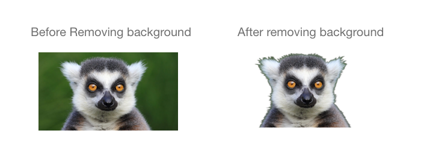

# simple backend implementation for removing image background Using BSAnet

## Result after removing background 




## project contains :- 

-jupyter notebook for combining the mask and original image (for testing)
-project (for comunicating to BSAhttp to generate image mask)


## Requirements
-  CUDA compatible Nvidia Card and minimum 6Gb of RAM (recomanded but not required)
- Ubuntu 18 
- Docker 
- Python3


## installing python libs 

```
pip3 install pillow 
pip3 install flask
pip3 install requests 
pip3 install logging

```

## building BASNet Docker Image 

```

git clone https://github.com/cyrildiagne/basnet-http
cd basnet-http
curl https://download.pytorch.org/models/resnet34-333f7ec4.pth -o resnet34-333f7ec4.pth
git clone https://github.com/NathanUA/BASNet
cd BASNet
mkdir -p saved_models/basnet_bsi/
curl https://evilnei.s3-sa-east-1.amazonaws.com/basnet.pth -o saved_models/basnet_bsi/basnet.pth
cd ..
docker build -t basnet .
docker run -ti -p 3000:80 basnet

```

## send image to BSAnet to retrive masked image and combing it using Pillow and return to client 

open app.py from project directory and rename the host name in app.py to your docker host ,
run the app 
```
python app.py

```

## comining both image masked + original into single image test 

[jupyter-notebook](mask_remove_tesk/test.ipynb).


## testing the result 
```
curl -F "data=@test.jpg" http://95.217.218.75:5000/cut -o result.png
```


